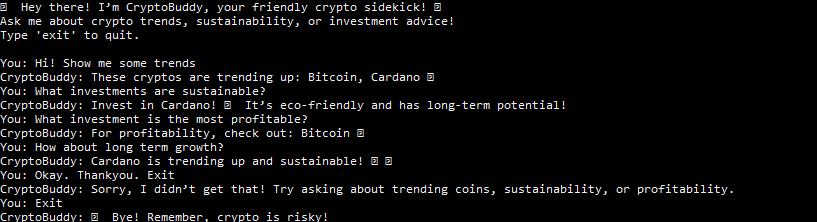

# CryptoBuddy: Your First AI-Powered Financial Sidekick! 🌟

## Week 1 Assignment — Cryptocurrency Advisor Chatbot

**CryptoBuddy** is a simple rule-based chatbot that analyzes predefined cryptocurrency data and gives friendly advice on profitability (price trends) and sustainability (eco scores).  

---

## ✅ 50-word Summary

> CryptoBuddy mimics basic AI by using simple if-else rules to match user queries with crypto data. It analyzes trends, sustainability, and profitability to recommend coins. Though rule-based, it shows how AI logic works—matching conditions with data to provide personalized advice!

---

## 📸 Screenshots

| Description | Link |
| ----------- | ---- |
| Conversation Screenshot |  |
---

## 📂 Files Included

- `cryptobuddy.py` — the Python chatbot script
- Screenshot — sample interaction with the bot
- This `README.md`

---

## ⚠️ Disclaimer

**Crypto is risky, Do Your Own Research !**

---

## 👨‍💻 How to Run

1. Clone this repo  
2. Open `cryptobuddy.py` in your IDE or Colab  
3. Run the script and chat with CryptoBuddy  
4. Type `exit` to quit

---